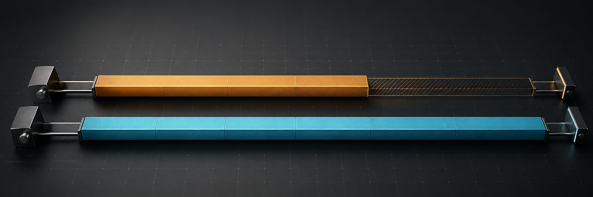

# BenchDelta

[فارسی](README.md) · [CI recipe](docs/CI.md) · [Report a workflow problem](https://github.com/al1re3a/benchdelta-report/issues/new?template=feedback.yml)



[](https://github.com/al1re3a/benchdelta-report/actions/workflows/ci.yml)
[](LICENSE)

**Compare two saved Hyperfine runs. Find commands that got slower, then share the result.**

Hyperfine measures commands. BenchDelta reads its JSON exports from two separate runs, matches command names, and highlights mean runtime changes against your budget. It also reports added and removed commands.

## Try it locally in your browser

Download **benchdelta-browser.zip** from the [latest release](https://github.com/al1re3a/benchdelta-report/releases/latest), extract all files, and open `index.html`. No Python or Node installation is needed. If your browser blocks clipboard access from a local file, use Download JSON or serve the folder as below.

No JavaScript package installation or server-side processing is needed:

```bash
git clone https://github.com/al1re3a/benchdelta-report.git
cd benchdelta-report
python build_demo.py
python -m http.server 8781 --bind 127.0.0.1 --directory dist
```

Open <http://localhost:8781>. Try the clearly labelled synthetic sample, or choose your own before/after JSON files. Adjust the budget, copy a Markdown comparison, or download JSON. Selected file contents stay in the browser.

## Compare your own measurements

Install [Hyperfine](https://github.com/sharkdp/hyperfine#installation) separately. Run the same command before and after your change, in comparable conditions:

```bash
hyperfine --warmup 3 --export-json before.json 'your-command'
# Apply the change you want to measure.
hyperfine --warmup 3 --export-json after.json 'your-command'
python benchdelta.py before.json after.json --threshold 10 --html report.html
```

Python 3.12+; no Python dependencies. The CLI prints JSON and optionally creates a standalone HTML report. Output files are never overwritten. Exit status is `0` for no over-budget comparable commands, `1` for an over-budget mean, and `2` for invalid input or an output error. See the [CI recipe](docs/CI.md) for preserving reports when a check fails.

## What the sample means

The built-in sample is **synthetic**, not a measured speed claim: `build` changes from 1.00 s to 1.25 s (+25%), while `test` changes from 2.00 s to 1.70 s (−15%). With a 10% budget, the former is flagged and the latter is an improvement. Replace both files with your measurements before drawing conclusions.

## Limits and alternatives

> [!IMPORTANT]
> Mean changes are not statistical significance. Noise, different machines, cache state, or changing command names can make comparisons misleading.

- Added/removed commands do not fail the budget check; review missing commands separately.
- Browser: 4 MiB and 2,000 commands per file. CLI: 32 MiB per file.
- BenchDelta does not execute benchmarks, manage baseline storage, or post PR comments.
- Hyperfine already provides export formats and analysis scripts. Use its raw samples and statistical tools when you need significance testing; this tool focuses on reviewing separate saved runs.
- Hosted pages may produce ordinary hosting request metadata; benchmark file contents are not uploaded by this app.

## Development

```bash
python -m unittest discover -s tests -v
node --test tests/*.test.cjs
python build_demo.py
```

Node 22+ is used for JavaScript tests. The browser comparison has no runtime package dependencies. The Persian [README](README.md) includes architecture and contribution details.

If this fits your workflow, a star helps you find it again. Feedback with a small non-sensitive export is especially useful: tell us what you measured and what was confusing.
