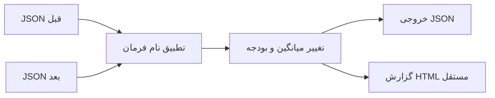

<p align="center"></p>

<h1 align="center">BenchDelta</h1>

[English documentation](README.en.md) · [راهنمای استفاده در CI](docs/CI.md)

**بدون نصب:** فایل `benchdelta-browser.zip` را از [آخرین انتشار](https://github.com/al1re3a/benchdelta-report/releases/latest) بگیرید، همهٔ فایل‌ها را استخراج کنید و `index.html` را باز کنید. اگر مرورگر کپی‌کردن از فایل محلی را محدود کرد، دانلود JSON همچنان در دسترس است.

**دموی مرورگر:** با `python build_demo.py` و سپس `python -m http.server 8781 --bind 127.0.0.1 --directory dist`، صفحهٔ <http://localhost:8781> را باز کنید. دو فایل JSON خودتان را انتخاب کنید؛ فایل‌ها در مرورگر پردازش می‌شوند. نمونهٔ اولیه ساختگی و با همین عنوان مشخص شده است.
<p align="center"><strong>مقایسهٔ خروجی Hyperfine و گزارش HTML آفلاین</strong></p>

<p align="center">
  <a href="https://github.com/al1re3a/benchdelta-report/actions/workflows/ci.yml"></a>
  <a href="LICENSE"></a>
  
  <a href="https://github.com/al1re3a/benchdelta-report/releases"></a>
</p>

<p align="center">
  <a href="#quick-start"></a>
  <a href="docs/USAGE.md"></a>
  <a href="https://github.com/al1re3a/benchdelta-report/issues"></a>
</p>

مقایسهٔ دو خروجی موجود Hyperfine با بودجهٔ افت سرعت و گزارش مستقل HTML؛ بدون سرور و وابستگی Python.

<details>
<summary>✨ نشان متحرک پروژه</summary>


</details>

---

<a id="contents"></a>
## 🧭 فهرست

[قابلیت‌ها](#features) · [شروع سریع](#quick-start) · [فناوری‌ها](#stack) · [معماری](#architecture) · [تست](#tests) · [محدودیت‌ها](#limitations) · [مشارکت](#contributing)

<a id="features"></a>
## ✨ چه کاری انجام می‌دهد؟

- ✅ هم‌ترازسازی نتیجه‌ها با نام command و نمایش موارد اضافه یا حذف‌شده
- ✅ محاسبهٔ تغییر میانگین زمان و بودجهٔ درصدی قابل‌تنظیم
- ✅ کد خروج ۱ برای افت بیش از بودجه و ۲ برای ورودی نامعتبر
- ✅ HTML مستقل با فیلتر و مرتب‌سازی و بدون درخواست شبکه
- ✅ مقایسهٔ مستقیم دو فایل در مرورگر، تنظیم بودجه، کپی Markdown و دانلود JSON

| مشخصه | مقدار |
|---|---|
| مخاطب | نگه‌دارندهٔ CLI، کتابخانه و تیم کارایی |
| فناوری و پیش‌نیاز | Python 3.12+ · Node 22 برای تست رابط |
| نسخه | 0.2.0 |
| مجوز | MIT |
| مدل اجرا | ابزار محلی؛ بدون حساب سرویس خارجی |

<a id="quick-start"></a>
## ⚡ نصب و شروع سریع

```bash
git clone https://github.com/al1re3a/benchdelta-report.git
cd benchdelta-report
```

برای Python پیشنهاد می‌شود ابتدا `python -m venv .venv` اجرا و محیط را فعال کنید: در Bash با `source .venv/bin/activate` و در PowerShell با `.venv/Scripts/Activate.ps1`.

```bash
python benchdelta.py examples/before.json examples/after.json --threshold 10 --html report.html
```

فایل `report.html` را در مرورگر باز کنید. مثال، build را ۲۵٪ کندتر و test را ۱۵٪ سریع‌تر نشان می‌دهد؛ خروج با کد ۱ در این مثال انتظار می‌رود. برای دادهٔ واقعی، ابتدا دو اجرای قابل‌مقایسهٔ Hyperfine را با `--export-json` ذخیره کنید.

> [!NOTE]
> افت میانگین در یک اجرای بنچمارک به‌تنهایی اثبات regression واقعی نیست؛ آزمایش را در شرایط ثابت تکرار کنید.

برای توقف فرمان یا سرور توسعه، در ترمینال <kbd>Ctrl</kbd> + <kbd>C</kbd> را فشار دهید.

<a id="stack"></a>
## 🧰 فناوری‌ها

<picture>
  <source media="(prefers-color-scheme: dark)" srcset="https://skillicons.dev/icons?i=py,js,html,css&amp;theme=dark">
  <source media="(prefers-color-scheme: light)" srcset="https://skillicons.dev/icons?i=py,js,html,css&amp;theme=light">
  
</picture>

Python · JavaScript · HTML · CSS

<a id="architecture"></a>
## 🏗 معماری



<details>
<summary>📁 ساختار فایل‌ها</summary>

```text
benchdelta-report/
  benchdelta.py
  report_ui.py
  web/
  examples/
  tests/
  assets/readme-banner.png
  docs/USAGE.md
  .github/workflows/ci.yml
```

</details>

<a id="tests"></a>
## 🧪 تست و وضعیت بررسی

```bash
python -m unittest discover -s tests -v
node --test tests/*.test.cjs
python build_demo.py
```

در اعتبارسنجی محلی Windows در ۲۰۲۶-۰۹-۰۵، **۱۱ تست Python و ۱۴ تست JavaScript (مجموعاً ۲۵ تست)** پاس شد و دموی استاتیک ساخته شد. [هر چهار اجرای CI نسخهٔ 0.2.0](https://github.com/al1re3a/benchdelta-report/actions/runs/33979863682) نیز موفق بود. جزئیات محیط و موارد بررسی‌نشده در [VALIDATION.md](VALIDATION.md) آمده است؛ تست کامل همهٔ مرورگرها انجام نشده است.

<a id="limitations"></a>
## ⚠️ محدودیت‌ها

فقط میانگین زمان و نام command مقایسه می‌شود؛ اندازهٔ نمونه، confidence interval و معنی‌داری آماری محاسبه نمی‌شوند. شرایط ماشین و نام فرمان‌ها باید قابل‌مقایسه باشند. بودجهٔ منفی یا NaN، میانگین نامثبت و نام تکراری رد می‌شوند. هر ورودی حداکثر ۳۲ MiB؛ گزارش موجود بازنویسی نمی‌شود.

### نسبت به ابزارهای مشابه

مرجع مرتبط: [Hyperfine](https://github.com/sharkdp/hyperfine). انتخاب این دامنه بر اساس بررسی مستندات ابزارهای مشابه است؛ ادعای برتری کلی، سرعت بیشتر یا تضمین جذب استار نداریم. مزیت این نسخه: مقایسهٔ دو خروجی موجود Hyperfine با بودجهٔ افت سرعت و گزارش مستقل HTML؛ بدون سرور و وابستگی Python.

### 🗺 وضعیت توسعه

| قابلیت | وضعیت |
|---|---|
| قابلیت‌های فهرست‌شده و مثال‌ها | ✅ پیاده‌سازی‌شده |
| تست‌های اصلی محلی | ✅ پاس‌شده |
| نمایش پراکندگی نمونه‌ها و مقایسهٔ آماری | ⏳ پیشنهاد آینده؛ پیاده‌سازی نشده |

---

<a id="contributing"></a>
## 🤝 مشارکت و بازخورد

📚 [راهنمای استفاده](docs/USAGE.md) · 🔐 [گزارش امنیتی](SECURITY.md) · 🤝 [راهنمای مشارکت](CONTRIBUTING.md) · 📣 [برنامهٔ معرفی](LAUNCH.md)

اگر پروژه مسئله‌ای از کار شما حل کرد، یک نمونهٔ بدون دادهٔ خصوصی در issue توضیح دهید. استار برای پیدا کردن دوبارهٔ پروژه و دنبال‌کردن [سازنده](https://github.com/al1re3a) برای دیدن ابزارهای بعدی اختیاری است.

<a href="https://github.com/al1re3a/benchdelta-report/graphs/contributors"></a>

بنر با ImageGen تولید شده و تصویر مفهومی است، نه اسکرین‌شات برنامه. [منشأ تصویر](assets/IMAGE.md). تصاویر badge، آیکون و انیمیشن README از سرویس‌های ثالث بارگذاری می‌شوند؛ خود بنر داخل ریپازیتوری است. تاریخ کامیت‌ها واقعی است و تاریخچهٔ بازسازی‌شده نداریم.
